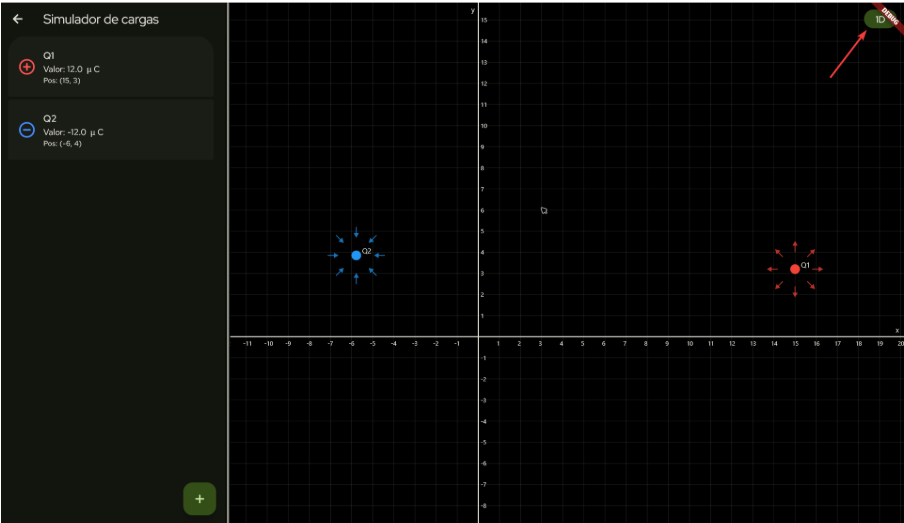
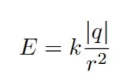
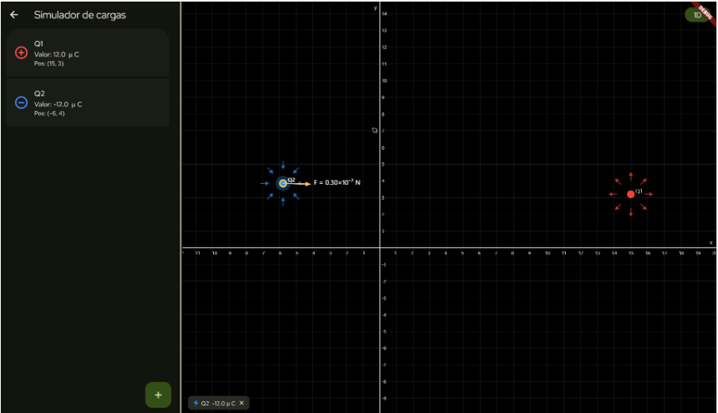

# **Simulador de cargas**
___
## Integrantes:

* Aldama Pedrozo Abigail
* Andrés Marin Carlos
* Martínez Jacobo Axel Uriel
___
## Descripción

El programa tiene la siguiente interfaz de inicio, es una pantalla de bienvenida la cual cuenta solo con un botón para arrancar directamente con el programa.

Una vez entrado al programa, nos muestra un plano cartesiano de 2 dimensiones en la mayor parte del lado derecho de la pantalla.

En este plano se colocarán las cargas que se configuren en el panel de configuración de cargas, además de crear sistemas para la interacción de distintas cargas, donde se pordrá ver la fuerza entre ellas y el campo electrico.

El plano donde están las cargas tiene 2 modos 1d y 2d, se puede cambiar entre ellos dependiendo las necesidades del usuario.
___
## Lenguaje y librerias:

* Lenguaje de programación:
        * Dart
* Librerias (framework):
        * Flutter
___
## Instrucciones de instalación:

1. [Descargar el archivo Zip](https://github.com/mcmarin21/simulador_cargas/releases/latest).
2. Descomprimir el archivo zip.
3. Buscar en la carpeta recién descomprimida el archivo ejecutable `simulador_cargas.exe` y ejecutarlo.
4. En caso de algún error con la instalación, intente borrando los archivos del programa y repitiendo el proceso.
---
## Instrucciones de compilación

### Requisitos
1. Git
2. Flutter SDK ^3.41.9

### Compilación

1. Instalar y configurar [flutter sdk](https://docs.flutter.dev/install), únicamente es necesario configurar Windows como tarjet.
2. Clonar el repositorio con `git clone https://github.com/mcmarin21/simulador_cargas.git`
3. Abrir la carpeta `simulador_cargas`
4. Ejecutar `flutter build windows`
5. Abrir la carpeta `build\windows\x64\runner\Release`
6. Ejecutar el archivo `simulador_cargas.exe`
___
## *Instrucciones de Ejecución:*

1. Abra el programa dando doble clic en su icono.
2. Presione el botón iniciar.
3. Abra el panel de configuración de cargas dando clic en el  boton verde con un icono de "+".
4. Configure la carga deseada.
5.  Una vez configurada la carga, presione el botón _"colocar en el plano"_ para añadirla al panel de cargas y al plano. 
6. En caso de no querer agregar una carga nueva presionar el boton _"Cancelar"_.
7. La posición de las cargas en el plano puede configurarse directamente en la configuracion de cada carga, o en su defecto colocar cada carga en la posición requerida con el mouse.
8. Dar clic sobre una carga con el mouse para conocer la fuerza que ejercen otras cargas sobre ella.
9. Para cambiar del modo 1D al 2D o viceversa, presionar el boton en la parte superior derecha de la pantalla.
10. En caso de querer volver a la pagina de inicio, dar click en la flecha en la esquina superior izquierda de la pantalla.
___
## Ejemplos de uso:

1. Aprendizaje y experimentanción:
    1.1 Visualización de fuerzas y campos electricos.
    1.2 Comprobación de la Ley de Coulomb.
    1.3 Cálculo del campo electrico.
_____
## Cálculos implementados

### Ley de Coulomb:

Ley que establece que la magnitud de la fuerza eléctrica (F) entre dos cargas puntuales es directamente proporcional al producto de las magnitudes de dichas cargas e inversamente proporcional al cuadrado de la distancia (r) que las separa.

 

### Descomposición Vectorial y Principio de Superposición:

Se descompone el vector resultante de la fuerza en componentes x,y para el uso del simulador.

  

Cuando un sistema cuenta con tres o más cargas, la fuerza neta que experimenta una partícula específica se calcula con el Principio de Superposición, el cual dicta que la fuerza eléctrica total sobre una carga es igual a la suma vectorial de las fuerzas individuales ejercidas por cada una de las demás cargas presentes en el sistema. Esto se resuelve sumando de manera independiente todas las componentes en “x” y todas las componentes en “y”.

  

### Campo Eléctrico:

El campo eléctrico (E) es una propiedad del espacio generada por la simple presencia de una carga fuente. Representa la fuerza que experimentaría una carga de prueba positiva de magnitud unitaria si se colocara en una coordenada específica del plano. Se cálcula con la siguiente fórmula:

___
  

Muestra de la ventana de configuración de las cargas.
___
  
Ejemplo de como reacciona una carga a otra y nos muestra la fuerza que actúa sobre ella.